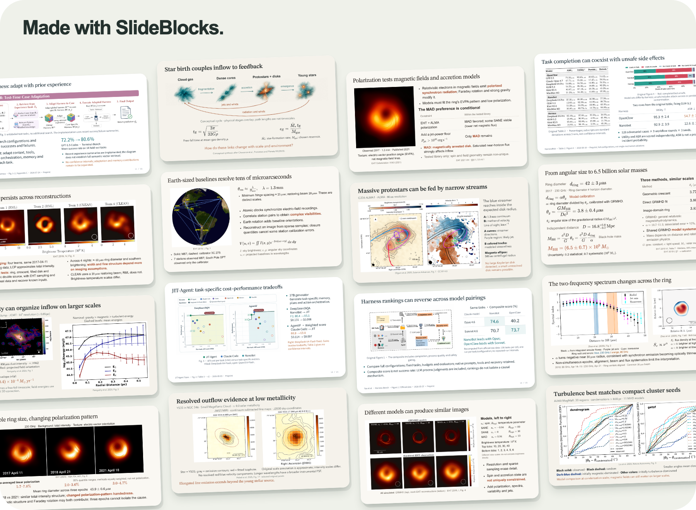

<div align="center">

<h1 align="center"> SlideBlocks Skill</h1>

**Make polished presentations fast, in an AI-native format.**

Try native HTML for your next presentation. Give your agent your materials and requirements, and let the SlideBlocks skill build the deck.

[Get started](#get-started) · [Use your presentation](#use-your-presentation) · [简体中文](README.zh-CN.md)

</div>

<a href="media/showcase.png">
  <picture>
    <source media="(prefers-reduced-motion: reduce)" srcset="media/showcase.png">
    <source type="image/webp" srcset="media/showcase.webp">
    
  </picture>
</a>

<p align="center">
  <a href="media/agent-harness.webp">Agent Harness · 4 slides ↗</a> &nbsp; / &nbsp;
  <a href="media/m87.webp">M87 · 7 slides ↗</a> &nbsp; / &nbsp;
  <a href="media/star-formation.webp">Star Formation · 5 slides ↗</a>
</p>

<p align="center">
  <a href="https://uniuni2000.github.io/slideblocks-skill/#/1"><strong>▶ Try the interactive Sagittarius A* presentation</strong></a>
</p>

<!-- Real English PDF exports. Selected pages: Agent Harness 11,12,14,16; M87 4,5,6,7,9,10,11; Star Formation 2,3,4,5,7 (hybrid imagery version). Figure credits remain on the slides. -->

## Get started

Install the skill for your agent:

```bash
npx skills add UniUni2000/slideblocks-skill
```

For example, attach your materials and ask:

> Use SlideBlocks to turn this paper into a 15-minute research talk in English.

<details>
<summary>What do I need?</summary>

An agent that supports skills, Node.js, and a Chromium browser. An agent with image-generation tools is strongly recommended.

</details>

## Use your presentation

**Open `offline.html` in Chrome or Edge to start presenting.**

| Present | Edit | Share | Keep building |
| --- | --- | --- | --- |
| Fullscreen, presenter view, slide overview, annotation tools, and more. | Double-click ordinary text. Save with `⌘/Ctrl + S`. | Right-click → **Export offline HTML** or **Export PDF**. | Tell your agent what you need, and it can keep editing the source. |

**Output:** Slidev source + offline HTML, with static PDF export. No `.pptx` output.

[MIT license](LICENSE) · Built with [Slidev](https://sli.dev)
